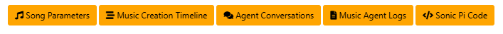

# MusicAgent Web Interface

1. [Introduction](#introduction)
2. [Launching the agent](#Launching-the-agent)

## Introduction
The MusicAgent web interface is a more simple way to interact with the MusicAgent. 
It allows you to create music, generate album covers, and more.


## Launching the agent

Running the web application will allow you to interact with the MusicAgent via a web interface.
To start up the application, run the following command:

```bash
python app.py
```
The application will be available at `http://localhost:5000`.

## Dashboard Setup

The dashboard foresees in multiple ways to follow up the song creation process by launching different widgets.



### Song Parameters

The Song Parameters widget enables to overview the parameters as being transferred to the individual agents throughout the music creation chain.


### Music Creation Timeline

The timeline widget enables to follow up the different phases (and composite cycles) of the music generation process.


### Agent Conversations

The agent conversations widget enables to follow up the chat conversations with the different agents.     


It will also display the generated album cover (if part of the agent configuration):


### Sonic Pi Code

The Sonic Pi widget enables to follow up the different versions of sonic pi code that is being generated by the MusicAgent.
It also allows to copy/paste or even send the code to the Sonic Pi IDE.
For the send option, you'll need to have the Sonic Pi IDE running and the listener script running (cf. [Sonic Pi Setup README](../SonicPi/Setup/README.md)).


### Music Agent Logs

The Music Agent Logs widget enables to follow up the logs while MusicAgent is running.


## Additional Options

### Agent Configuration
The agent can be configured in the [AgentConfig](AgentConfig) folder but also via web interface.


