# MusicAgent Web Interface

1. [Introduction](#introduction)
2. [Launching the agent](#launching-the-agent)
3. [New Song Creation](#new-song-creation)
    - [Song Parameters](#song-parameters)
    - [Music Creation Timeline](#music-creation-timeline)
    - [Agent Conversations](#agent-conversations)
    - [Sonic Pi Code](#sonic-pi-code)
    - [Music Agent Logs](#music-agent-logs)
    - [Additional Options](#additional-options)
    - [Agent Configuration](#agent-configuration)
4. [Samples](#samples)
5. [Song Library](#song-library)
6. [Creative Mode](#creative-mode)
7. [Settings](#settings)
   
## Introduction
The MusicAgent web interface is a more simple way to interact with the MusicAgent. 
It allows you to create music, generate album covers, and more.

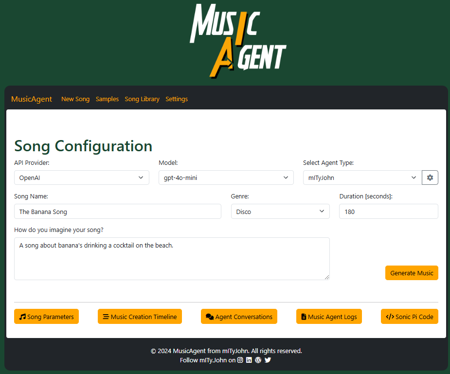

## Launching the agent

Running the web application will allow you to interact with the MusicAgent backend.

### Project setup
```
npm install
```

#### Compiles and hot-reloads for development
```
npm run serve
```
To simplify launch of the web app, you can also run  the `start_musicagent.bat` script in the main folder.
This will startup the web app, but also launch the backend application.

## Dashboard Setup

The dashboard foresees in multiple ways to follow up the song creation process by launching different widgets.

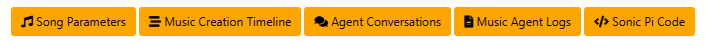

### Song Parameters

The Song Parameters widget enables to overview the parameters as being transferred to the individual agents throughout the music creation chain.

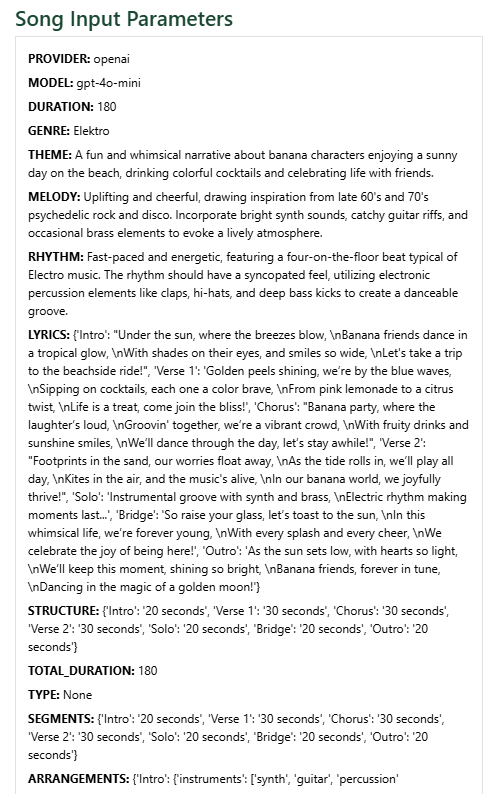

### Music Creation Timeline

The timeline widget enables to follow up the different phases (and composite cycles) of the music generation process.
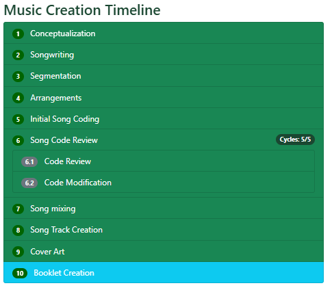

### Agent Conversations

The agent conversations widget enables to follow up the chat conversations with the different agents.     
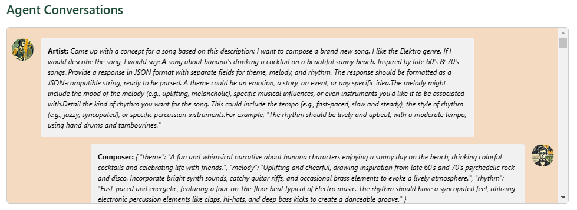

It will also display the generated album cover (if part of the agent configuration):
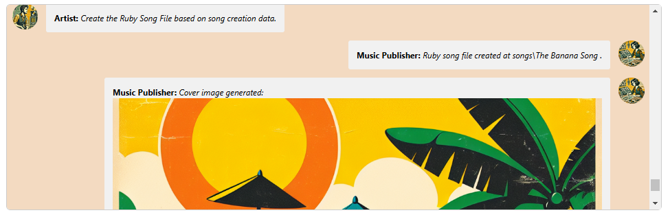

### Sonic Pi Code

The Sonic Pi widget enables to follow up the different versions of sonic pi code that is being generated by the MusicAgent.
It also allows to copy/paste or even send the code to the Sonic Pi IDE.
For the send option, you'll need to have the Sonic Pi IDE running and the listener script running (cf. [Sonic Pi Setup README](../SonicPi/Setup/README.md)).

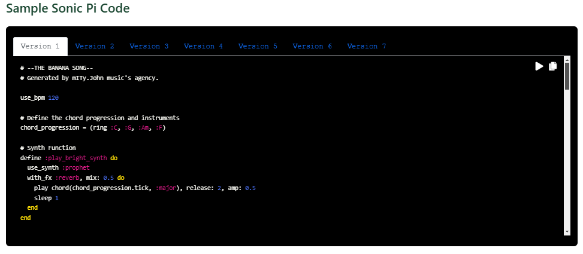

### Music Agent Logs

The Music Agent Logs widget enables to follow up the logs while MusicAgent is running.

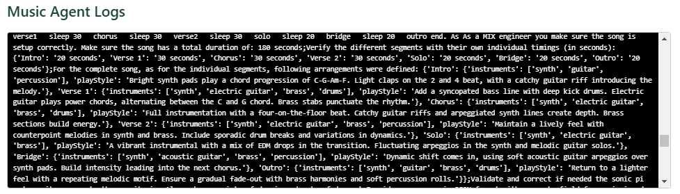

## Additional Options

### Agent Configuration
The agent can be configured in the [AgentConfig](AgentConfig) folder but also via web interface.

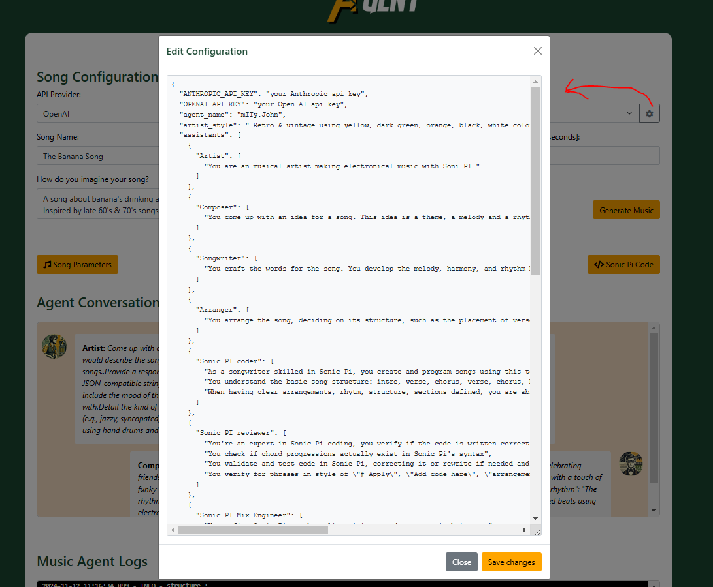


## Samples

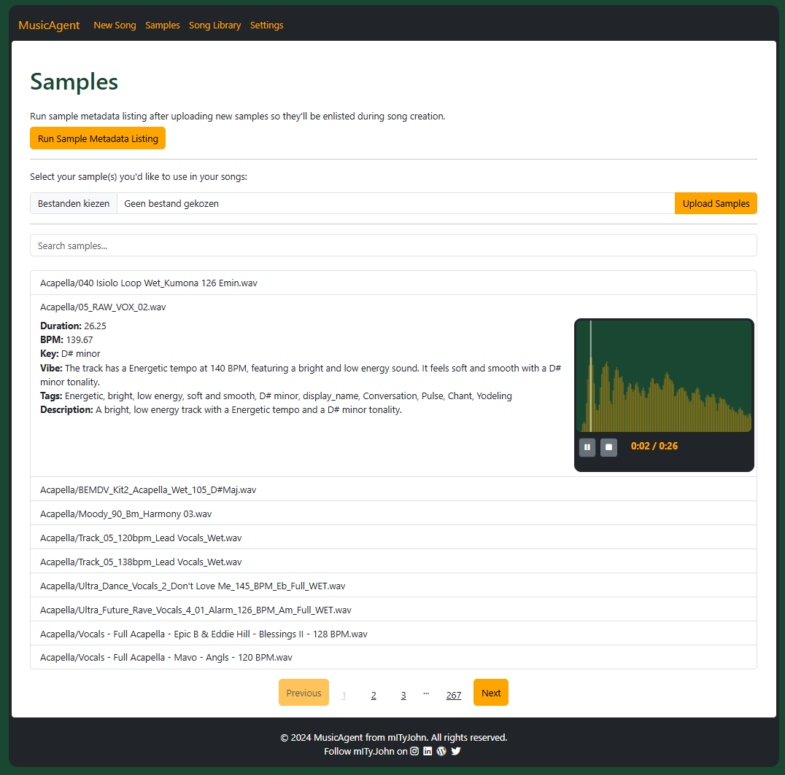

## Song-library
Paginated view of the songs created by the MusicAgent.
While selecting the song, you have the ability to see the album cover, and the sonic pi code.

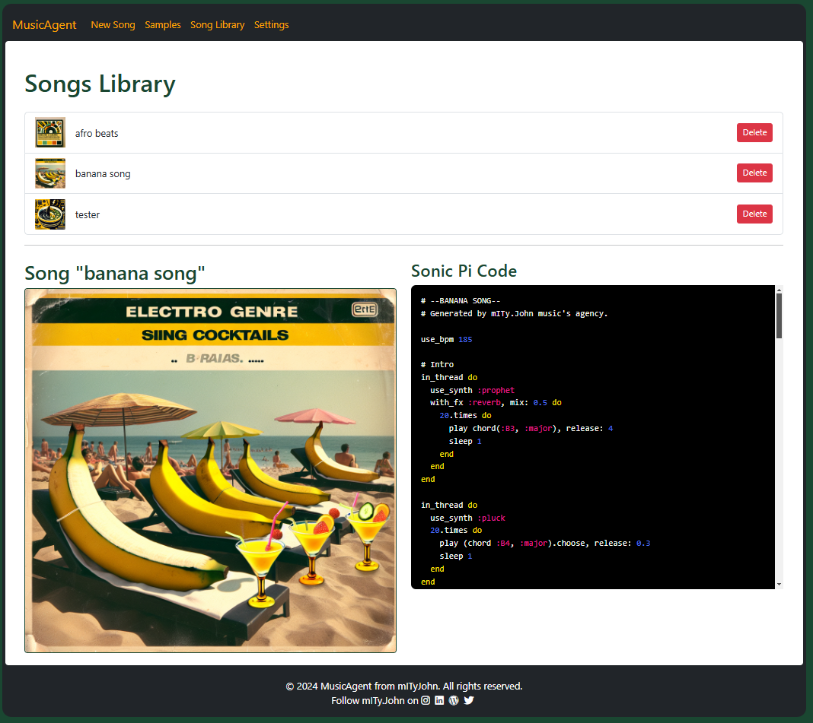

## Creative Mode
The creative mode allows you to create a song from scratch. You can chat directly with the MusicAgent and ask it to generate a song for you.

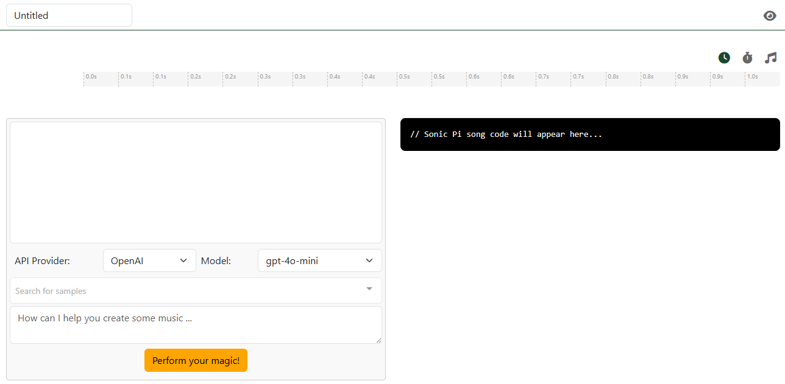

It also allows to you to select specific samples to be used in the song creation process. During song creation, MusicAgent will use the selected samples to generate the song.
But will also propose adjustments and enhancements to your song.
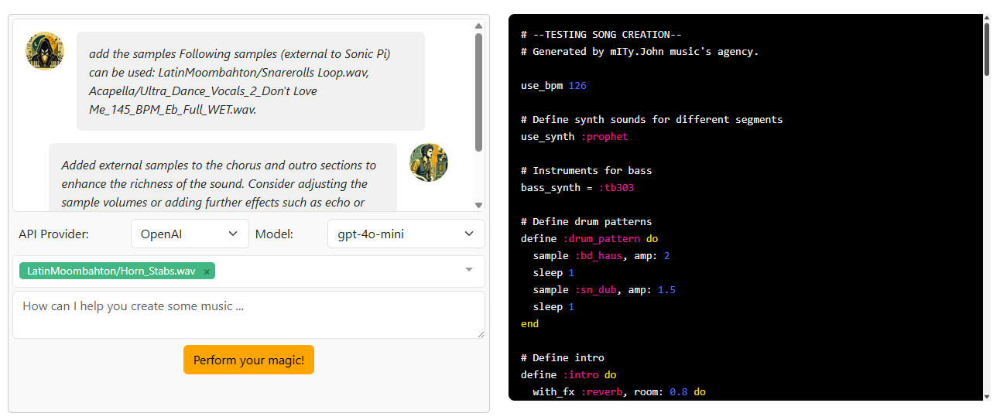

The Sonic Pi code will be visualized as well, giving you a better overview on the song structure and specific loops and threads used throughout the song.

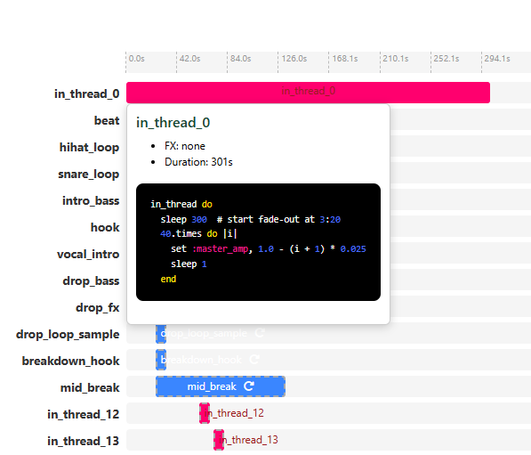

## Settings
Changing you agent style (impacts e.g. cover generation).

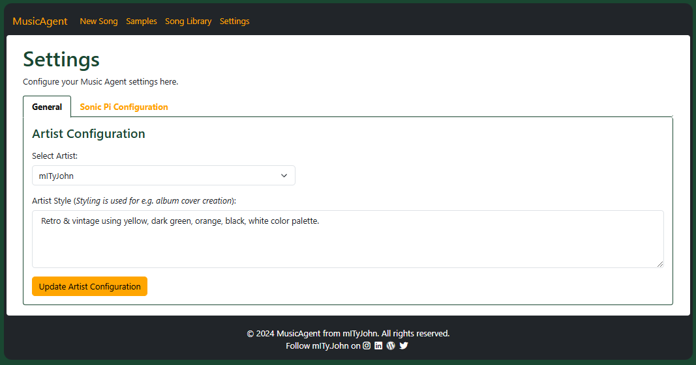

Modifying the Sonic Pi settings. In case you're not hearing any sound, you might want to check the Sonic Pi settings.

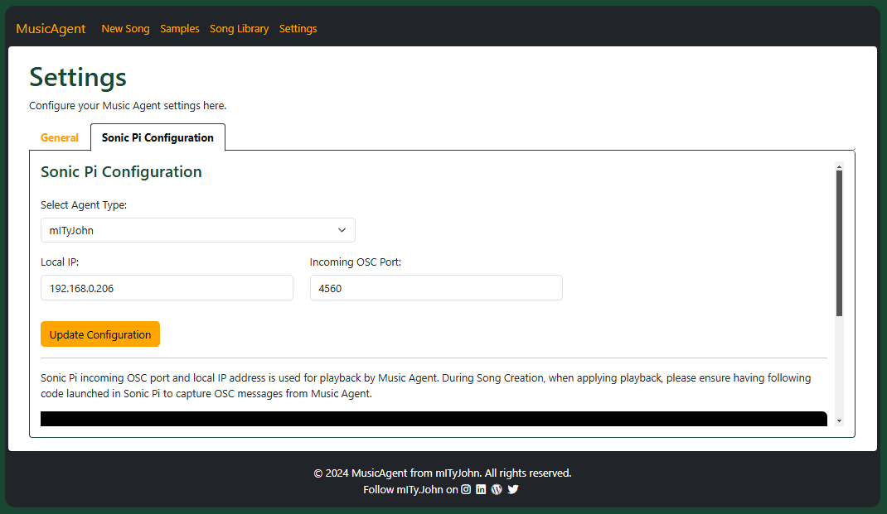
