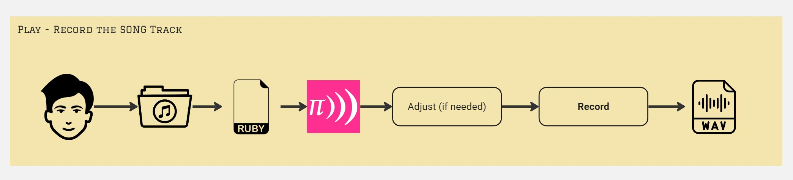

# MusicAgent User Manual


## Table of Contents
## Table of Contents
1. [Introduction](#introduction)
2. [How does it work?](#how-does-it-work)
3. [Using Music Agent](#using-music-agent)
    - [Prerequisites](#prerequisites)
    - [Installation](#installation)
4. [Configuration](#configuration)
5. [Running the MusicAgent](#running-the-musicagent)
6. [Output](#output)

---

## Introduction

MusicAgent is a Python agent that programs songs in Sonic Pi. 
It uses generative AI to generate song structures based on user preferences.
This manual provides instructions on installation, configuration, and song generation.
It does not yet generate singing voices, only instrumental versions.

## How does it work?

We defined different assistants, all having a different role throughout the phases of composing and writing a song.
The will handle the different steps, starting from the user's initial input.


The eventual output is a booklet with an album cover, and of course the coded song track in a *.rb file.

## Using Music Agent
### Prerequisites

- **Sonic Pi:** Must be installed on your system (needed to run the *.rb files): https://sonic-pi.net/
- **OPENAI_API_KEY:** Set as a system environment variable or in `ArtistConfig/mITyJohn/ArtistConfig.json`.
    On MAC
    ```bash
    export OPENAI_API_KEY='<your_api_key>'
    ```
    On Windows (using PowerShell)
    ```bash
    $env:OPENAI_API_KEY='<your_api_key>'
    ```
- **Python** Must be installed on your machine

### Installation

```bash
# Clone the repository
git clone [repository link]

# Install dependencies
pip install -r requirements.txt
```
### Configuration
Set **OPENAI_API_KEY** in `ArtistConfig/mITyJohn/ArtistConfig.json` if not set as a system variable.
Adjust settings in ArtistConfig.json as needed.

### Running the MusicAgent
```bash
python run.py
```
Once launched you'll be able to pass multiple criteria:
- Choose an AI model when prompted: "gpt-3.5-turbo", "gpt-4", etc.
- Provide song details: name, duration, style
- Optionally add specific requests like chord progressions or musical influences.

### Output
MusicAgent will generate the following in the songs folder in a subdirectory called by trackname:
- Track File Generated: the *.rb file can be found in the Songs directory. To play your track, simply load the file in SONIC PI.
- A booklet containing cover image (which resides in same subdirectory), lyrics & additional technical info on setup of the track
- Music Agent logging file. If Track code got lost or is incomplete, you can verify the logs.

