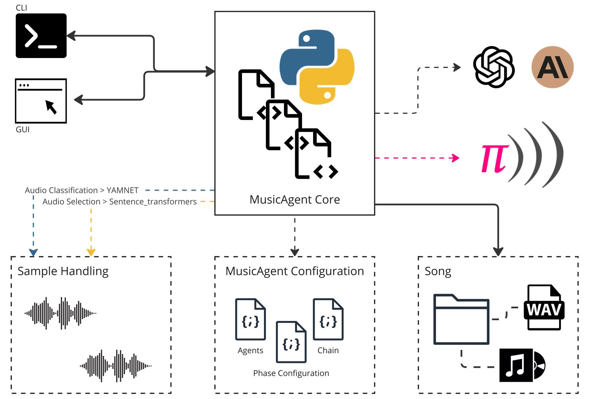
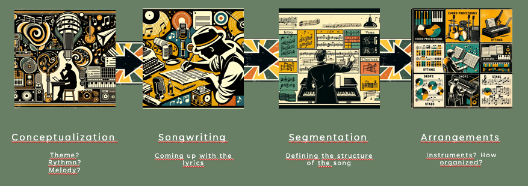
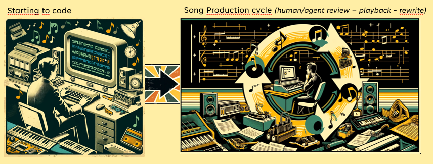
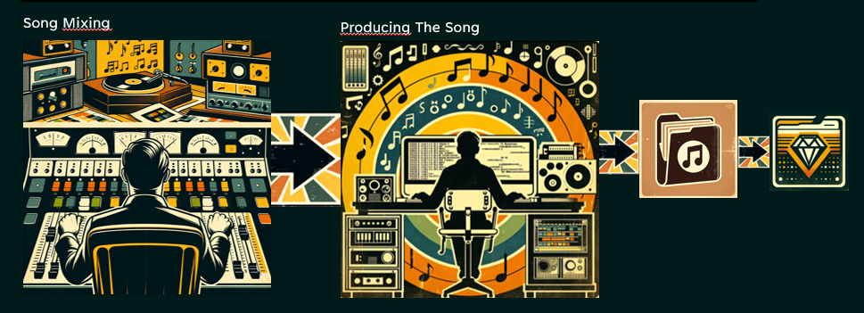
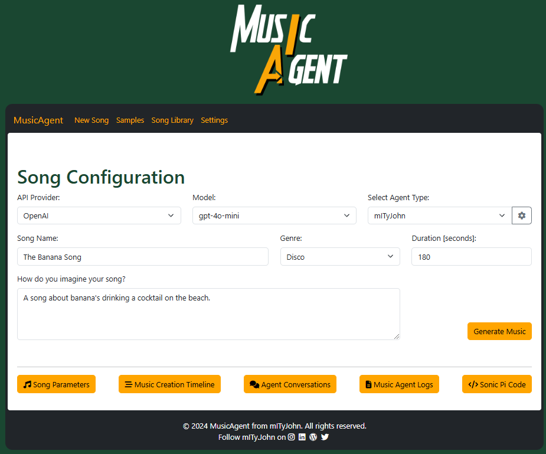

# MusicAgent User Manual


## Table of Contents
1. [Introduction](#introduction)
2. [How does it work?](#how-does-it-work)
3. [Using Music Agent](#using-music-agent)
    - [Prerequisites](#prerequisites)
    - [Installation](#installation)
    - [Samples](#samples)
4. [Configuration](#configuration)
5. [Running the MusicAgent](#running-the-musicagent)
   - [Web Application](#web-application)
   - [CLI](#cli)
6. [Output](#output)
7. [Demo](#Demo)
8. [About](#about)

---

## Introduction


MusicAgent is a MAS (Multi Agent System) that programs songs in Sonic Pi. 
It uses generative AI to generate song structures, arrangements, lyrics, ... based on user preferences.
This manual provides instructions on installation, configuration, and song generation.
It does not yet generate singing voices (you cna include them using samples, only instrumental versions.



## How does it work?

[Watch Music Agent in action](https://www.youtube.com/watch?v=rcfCjKbLkK0)

We defined different assistants, all having a different role throughout the phases of composing and writing a song.
The will handle the different steps, starting from the user's initial input.

The different assistant roles:
Different roles are defined in [ArtistConfig.json](AgentConfig/mITyJohn/ArtistConfig.json)
- Artist
- Composer
- Songwriter
- Arranger
- Sonic PI coder
- Sonic PI reviewer
- Sonic PI Mix Engineer
- Master Engineer
- Music Publisher


All roles take there part in different phases of composing a song.
- Configuration of sequences in the chaing can be found in  [MusicCreationChainConfig.json](AgentConfig/mITyJohn/MusicCreationChainConfig.json).
- Configuration and description of each phase is configured in [MusicCreationPhaseConfig.json](AgentConfig/mITyJohn/MusicCreationPhaseConfig.json).

### 1. Design Phase



### 2. Creation Phase
The actual creation of the sonic pi script, initial playback, 
iterating over agent or human review followed by code rewrite.



### 3. Mastering Phase


### 4. Publishing Phase

Depending on artist configuration, includes sonic pi script file genration, album cover, booklet and optional song recording.


The eventual output is a booklet with an album cover (optionally a recording depending on chosen configuration), and of course the coded song track in a *.rb file.

## Using Music Agent
### Prerequisites

- **Sonic Pi:** Must be installed on your system (needed to run the *.rb files): https://sonic-pi.net/
- **Python** Must be installed on your machine (Currently MusicAgent supports v12)

#### Model API

Music agents works as well with the OpenAI & Anthropic API (Anthropic currently does not provide image generation, so no album cover will be generated).
To switch in between both, make sure to set both variables in your config file or environment variables.

- **OPENAI_API_KEY:** Set as a system environment variable or in `ArtistConfig/mITyJohn/ArtistConfig.json`.

  On MAC:
    ```bash
    export OPENAI_API_KEY='<your_api_key>'
    ```
  On Windows (using PowerShell):
    ```bash
    $env:OPENAI_API_KEY='<your_api_key>'
    ```
- **ANTHROPIC_API_KEY:** Set as a system environment variable or in `ArtistConfig/mITyJohn/ArtistConfig.json`.
  
  On MAC:
    ```bash
    export ANTHROPIC_API_KEY='<your_api_key>'
    ```
  On Windows (using PowerShell):
    ```bash
    $env:ANTHROPIC_API_KEY='<your_api_key>'
    ```
  
### Installation

```bash
# Clone the repository
git clone [repository link]

# Install dependencies
pip install -r requirements.txt
```
Because of anthropic dependencies, you'll also need to install RUST: https://www.rust-lang.org/tools/install

### Samples

To use samples in your composition, we need a correct description of the samples. 
This listing will be provided to our agents to be taken into account when generating new music.
When adding new Sample packs, you can generate the metadata listing by launching the script.
```bash 
python SampleMedataListing.py
```
This will generate a JSON file with the samples metadata listing. 

    {
        "Filename": "Synth/Prophet REV2 KEYS Echo Low - C.wav",
        "Duration": 3.2,
        "BPM": 161.5,
        "Key": "A minor",
        "Vibe": "The track has a Energetic tempo at 161 BPM, featuring a warm and high energy sound. It feels soft and smooth with a A minor tonality.",
        "Tags": [
            "Energetic",
            "warm",
            "high energy",
            "soft and smooth",
            "A minor",
            "Whale vocalization",
            "Keyboard (musical)",
            "Piano",
            "Ukulele",
            "Music"
        ],
        "Description": "A warm, high energy track with a Energetic tempo and a A minor tonality.",
        "Track Type": "Instrumentals Only"
    }    
Yamnet is used to classify the samples. Read more about Yamnet in the [Yamnet README](Inc/yamnet-tensorflow2-yamnet-v1/README.md).

### Configuration
Set **OPENAI_API_KEY** in `ArtistConfig/mITyJohn/ArtistConfig.json` if not set as a system variable.
Adjust settings in ArtistConfig.json as needed.

By default, the artist mITyJohn will be ran with the basic chain of music creation.
But if you want additional sonic pi evaluation or even start a recording you can choose on of the other agent configurations=
- Eval: will evaluate your sonic pi code via sonic pi instance running on your machine
- Full: will evaluate your sonic pi code via sonic pi instance running on your machine but will also start a recording (currently only on windows machine)
- Art: limit to album cover generation based on artist configuration (no song generation)

For these extended chains an additional setup is needed:

1. Launch Sonic Pi on your machine
2. Adapt ArtistConfig.json with correct the sonic_pi_IP & sonic_pi_port (these can be found in Soni Pi IDE via menu>IO). Verify incoming OSC messages is allowed. 
3. Copy and run following code (needs to be running before starting MusicAgent)
```bash
live_loop :listen do
  use_real_time
  script = sync "/osc*/run-code"
  
  begin
    eval script[0]
    osc_send '127.0.0.1', 4559, '/feedback', 'MusicAgent Code was executed successfully'
  rescue Exception => e
    osc_send '127.0.0.1', 4559, '/feedback', e.message
  end
end
```
or just load `Sonicpi/Setup/recording.rb` in your Sonic PI.

4. Once launched, you'll notice the listener in your Cues being launched. This will enable Sonic Pi to play your music file and send feedback to MusicAgent.

### Running the MusicAgent

MusicAgent can be run in 2 different ways: via the CLI or via the web application.
#### Web Application

Running the web application will allow you to interact with the MusicAgent via a web interface.
```bash
python app.py
```
The app visualizes the different phases of the music creation process and allows you to interact with the MusicAgent.
You'll also be able to go through the chat conversation with the different agents.



Additionally, you can check out the different Sonic Pi versions, sending them even to the Sonic PI IDE.

More elaborate information on how to use the Music Agent web application can be found in [Music Agent App README](App/README.md)


#### CLI

Running the CLI will allow you to interact with the MusicAgent via the command line.
```bash
python run.py
```
Once launched you'll be able to pass multiple criteria:
- Choose an AI model when prompted: "gpt-3.5-turbo", "gpt-4", etc.
- Provide song details: name, duration, style
- Optionally add specific requests like chord progressions or musical influences.


Sonic PI examples can be found in 'SonicPi/Examples' folder.

### Output
MusicAgent will generate the following in the songs folder in a subdirectory called by trackname:
- Track File Generated: the *.rb file can be found in the Songs directory. To play your track, simply load the file in SONIC PI.
  - when using the "full artist" configuration, recording WAV file will be created additionally (without having to load it in sonic Pi afterwards) 
- A booklet containing cover image (which resides in same subdirectory), lyrics & additional technical info on setup of the track
- Music Agent logging file. If Track code got lost or is incomplete, you can verify the logs.


If you're using [mITyJohn_Full](AgentConfig%2FmITyJohn_Full) configuration when running the agent, and your recording device is correctly configured (only on windows currently), a recording will be made automatically.


## Sample Creation

To use sample in you composition, we need  a correct description of the samples. 
This listing will be provided to or agents to be taken into account when generating new music.

Samples listing can be added by launching the  script.
This will generate a JSON file with the samples listing in the correct format.

```bash
python SampleMedataListing.py
```
Example Listing
```bash
    {
        "Filename": "C:\\...\\Melody Loop - 110 BPM E Min.wav",
        "Duration": 8.73,
        "BPM": 109.96,
        "Vibe": "The track has a Moderate tempo at 110 BPM, featuring a warm and high energy sound. It feels soft and smooth with a A minor tonality.",
        "Key": "A",
        "Tags": [
            "Moderate",
            "warm",
            "high energy",
            "soft and smooth",
            "A minor",
            "Whale vocalization",
            "Hammond organ",
            "Ukulele",
            "Opera",
            "Music"
        ],
        "Description": "A warm, high energy track with a Moderate tempo and a A minor tonality."
    }
```
For Metadata generation, Yamnet is used to classify the samples. 
For more information on Yamnet, please refer to the [Yamnet README](Inc/yamnet-tensorflow2-yamnet-v1/README.md).

## About

Music Agent was originally developed by [mITyJohn](https://mityjohn.com/).
The project is open-source and available on GitHub for the community for contributions and improvements (just because it's fun!).
