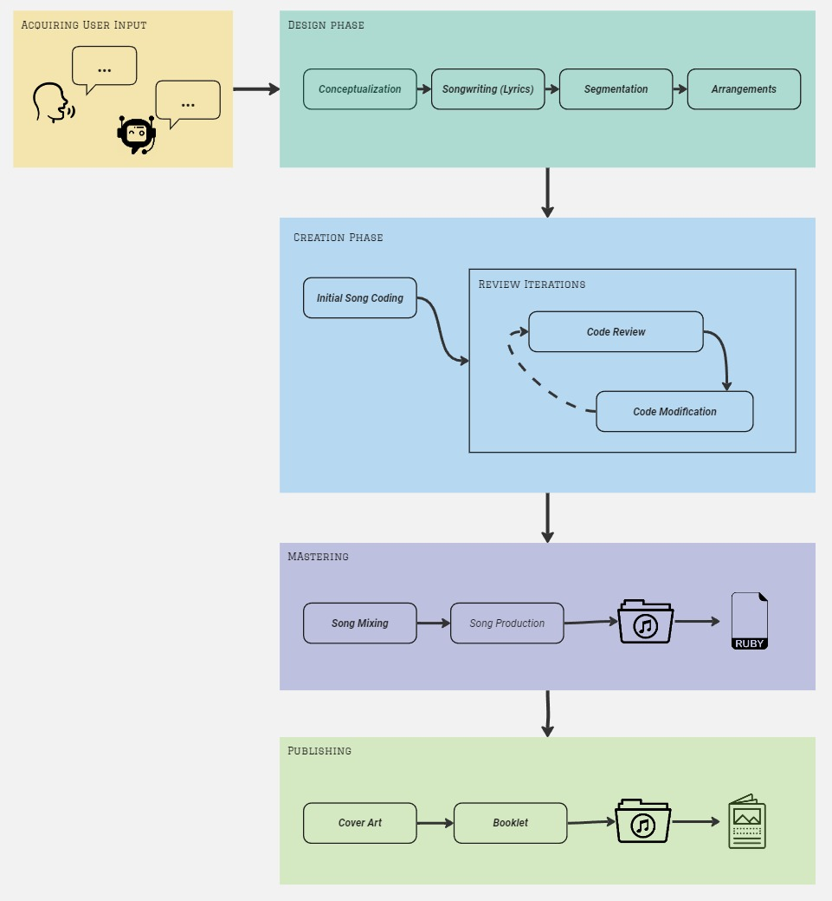

# MusicAgent User Manual


## Table of Contents
1. [Introduction](#introduction)
2. [How does it work?](#how-does-it-work)
3. [Using Music Agent](#using-music-agent)
    - [Prerequisites](#prerequisites)
    - [Installation](#installation)
4. [Configuration](#configuration)
5. [Running the MusicAgent](#running-the-musicagent)
6. [Output](#output)

---

## Introduction

MusicAgent is a Python agent that programs songs in Sonic Pi. 
It uses generative AI to generate song structures based on user preferences.
This manual provides instructions on installation, configuration, and song generation.
It does not yet generate singing voices, only instrumental versions.


## How does it work?

We defined different assistants, all having a different role throughout the phases of composing and writing a song.
The will handle the different steps, starting from the user's initial input.

The different assistant roles:
Different roles are defined in [ArtistConfig.json](AgentConfig/mITyJohn/ArtistConfig.json)
- Artist
- Composer
- Songwriter
- Arranger
- Sonic PI coder
- Sonic PI reviewer
- Sonic PI Mix Engineer
- Master Engineer
- Music Publisher

All roles take there part in different phases of composing a song.
- Configuration of sequences in the chaing can be found in  [MusicCreationChainConfig.json](AgentConfig/mITyJohn/MusicCreationChainConfig.json).
- Configuration and description of each phase is configured in [MusicCreationPhaseConfig.json](AgentConfig/mITyJohn/MusicCreationPhaseConfig.json).



The eventual output is a booklet with an album cover, and of course the coded song track in a *.rb file.

## Using Music Agent
### Prerequisites

- **Sonic Pi:** Must be installed on your system (needed to run the *.rb files): https://sonic-pi.net/
- **OPENAI_API_KEY:** Set as a system environment variable or in `ArtistConfig/mITyJohn/ArtistConfig.json`.
    On MAC
    ```bash
    export OPENAI_API_KEY='<your_api_key>'
    ```
    On Windows (using PowerShell)
    ```bash
    $env:OPENAI_API_KEY='<your_api_key>'
    ```
- **Python** Must be installed on your machine

### Installation

```bash
# Clone the repository
git clone [repository link]

# Install dependencies
pip install -r requirements.txt
```
### Configuration
Set **OPENAI_API_KEY** in `ArtistConfig/mITyJohn/ArtistConfig.json` if not set as a system variable.
Adjust settings in ArtistConfig.json as needed.

By default, the artist mITyJohn will be ran with the basic chain of music creation.
But if you want additional sonic pi evaluation or even start a recording you can choose on of the other agent configurations=
- Eval: will evaluate your sonic pi code via sonic pi instance running on your machine
- Full: will evaluate your sonic pi code via sonic pi instance running on your machine but will also start a recording (currently only on windows machine)

For these extended chains an additional setup is needed:

1. Launch Sonic Pi on your machine
2. Adapt ArtistConfig.json with correct the sonic_pi_IP & sonic_pi_port (these can be found in Soni Pi IDE via menu>IO). Verify incoming OSC messages is allowed. 
3. Copy and run following code (needs to be running before starting MusicAgent)
```bash
live_loop :listen do
  use_real_time
  script = sync "/osc*/run-code"
  
  begin
    eval script[0]
    osc_send '127.0.0.1', 4559, '/feedback', 'MusicAgent Code was executed successfully'
  rescue Exception => e
    osc_send '127.0.0.1', 4559, '/feedback', e.message
  end
end
```
or just load `Sonicpi/Setup/recording.rb` in your Sonic PI.

4. Once launched, you'll notice the listener in your Cues being launched. This will enable Sonic Pi to play your music file and send feedback to MusicAgent.

### Running the MusicAgent
```bash
python run.py
```
Once launched you'll be able to pass multiple criteria:
- Choose an AI model when prompted: "gpt-3.5-turbo", "gpt-4", etc.
- Provide song details: name, duration, style
- Optionally add specific requests like chord progressions or musical influences.

### Output
MusicAgent will generate the following in the songs folder in a subdirectory called by trackname:
- Track File Generated: the *.rb file can be found in the Songs directory. To play your track, simply load the file in SONIC PI.
- A booklet containing cover image (which resides in same subdirectory), lyrics & additional technical info on setup of the track
- Music Agent logging file. If Track code got lost or is incomplete, you can verify the logs.

